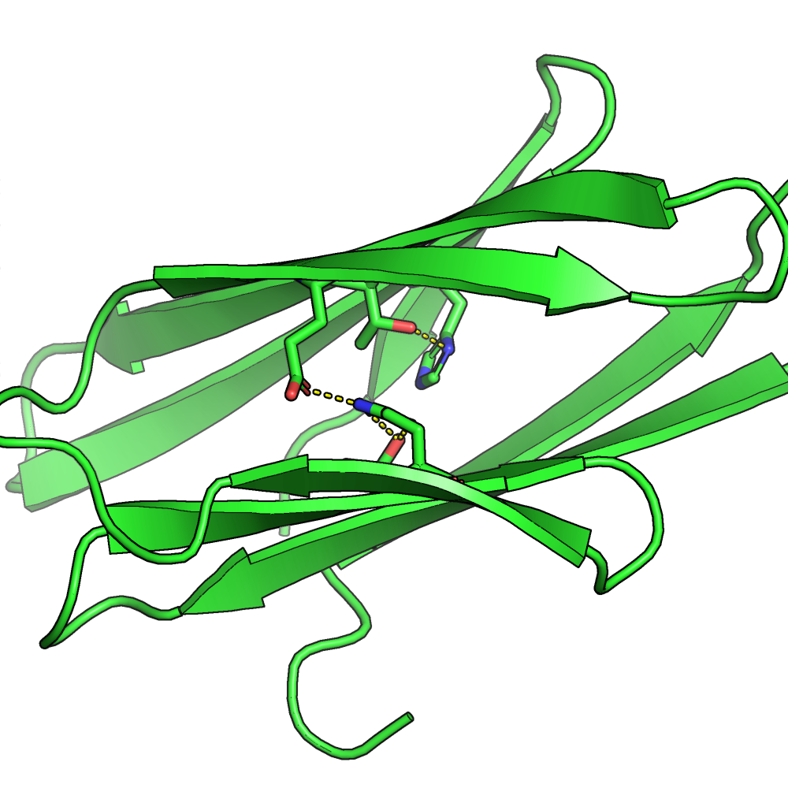

Hi! Once again, my name is Damir. This is my third attempt to start a blog. I've done three iterations so far:

1. Django Back-End Blog Application. First deployed to Heroku with an AWS S3 Bucket, and then deployed to GCP.
2. Static website using an HTML template I bought off the internet. Deployed to GitHub Pages.
3. This. Using Jekyll as a static site generator with a remote template. Still deployed to GitHub Pages.

This iteration uses a Jekyll template, [no style, please](https://github.com/riggraz/no-style-please).
I picked it because it seemed minimalist and hustle-free. No more headaches over the front-end issues.

## Who are you?

Nobody really reads this blog, but I still want to cover this. My name is Damir Temir. 
I come from [Kazakhstan](https://en.wikipedia.org/wiki/Kazakhstan). 
I'm currently in my third-year at the University of Illinois Springfield.

I'm interested in machine learning and software engineering. I love Python and its numerous frameworks.

## What are you?

This summer, I worked as a Research Assistant at Stanford University.
I was working on the [Protein Sequence Design Algorithm](https://github.com/ProteinDesignLab/protein_seq_des), 
specifically creating the [resfile interface](https://github.com/ProteinDesignLab/protein_seq_des/tree/master/seq_des/util).

This is the type of a protein we were able to build with a resfile:

## So what?

I'm mostly interested in Machine Learning. 
I hope to get some more Data Science and Software Engineering skills before I graduate in 2023 to get some industry experience.

I also hope to keep my journey documented. It's truly awesome to be able to read back on my experiences.
