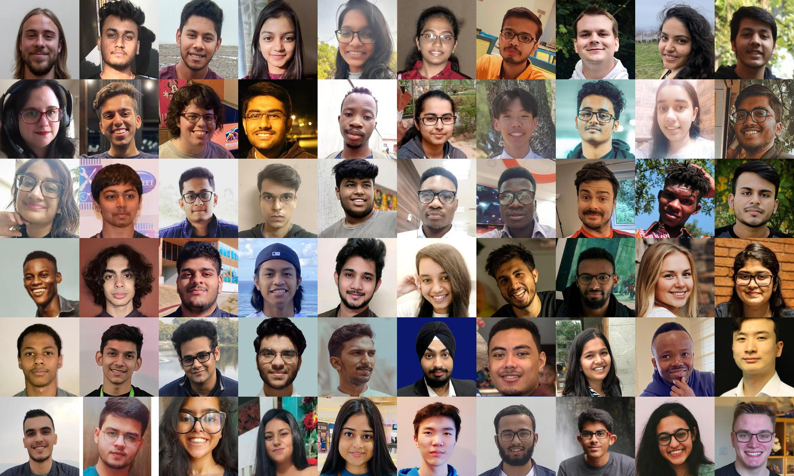
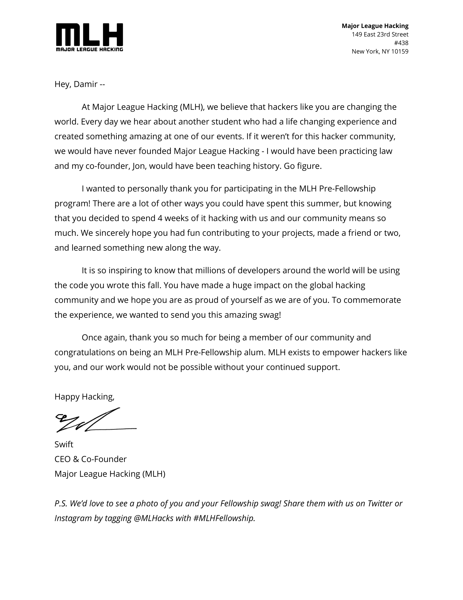

I was fortunate enough to be in the first ever [**MLH Pre-Fellowship**](https://fellowship.mlh.io/programs/prep) 
class this summer 2021, pod-3-1-3.

I met awesome people, explored new technologies, participated in hackathons (won one of them), 
and **met awesome people** (yeah, that was the best part)! 

*try finding me*

Let me tell you a little about the experience and why it is a revolutionary program for those who can't afford 
traditional industry-like IT experience

## What is MLH?

**Major League Hacking** is an official hackathon[^1] league that hosts numerous events for people interested in computer science
and building things. They help universities around the world to host their own hackathons while also educating community
on the importance of collaborative development through hackathons. They are sponsored by large IT companies like Facebook,
GitHub[^2], AWS, and others.

## What is the MLH Fellowship?

> The MLH Fellowship is a remote internship alternative for aspiring technologists. Spend 12 weeks building your skills by collaborating on real-world projects. *(c)[MLH](https://fellowship.mlh.io/)*

It is a program for students around the world to immerse in an alternative to a traditional 12 weeks internship that so 
many of us lost when the pandemic started. When the pandemic hit, students like me started speaking up because they lost
their summer 2020 internships. So MLH decided to give them an opportunity to still get some working experience.

The three tracks MLH offers today for the Full Fellowship are:

* Open Source
* Software Engineering
* Production Engineering

## What is the MLH Pre-Fellowship?

> The MLH Fellowship Prep Program is a 3-week preparation program for aspiring technologists who are interested in experiencing the fellowship before committing to the full 12-weeks. *(c)[MLH](https://fellowship.mlh.io/programs/prep)*

They have since updated the Pre-Fellowship program to be called *Prep* and shortened it by a week.
But the idea remains the same. 

The program is aimed at those who would like to have a taste of MLH before committing to 12 weeks of work.
It also helps build a portfolio of projects through short hackathons and teamwork.

## How does it work?

There were around 50 people in the program. We were split in five *pods* of around 10 members.
Each pod had a coach who was the person we worked with daily, and we also had a mentor to whom we could go with problems.

My pod was numbered [3.1.3](https://github.com/orgs/MLH-Fellowship/teams/pod-3-1-3) and we called it *Practically PI*.

A general timeline for our work together would be this:

- Week 1. 
   * Meet other members and have 1:1 meetings with all
   * Develop the [Jekyll website template](https://github.com/MLH-Fellowship/pod-3.1.3-portfolio) together as a pod
   * Participate in the [Pre-Fellowship Orientation Hackathon](https://pre-fellowship-orientation-3.devpost.com/) (I actually won this hackathon :D)
- Week 2.
   * Split up into smaller teams to work on the second hackathon
   * Do *spikes* to figure out what technologies you might want to use for the group projects
- Week 3.
   * Finalize the tech stack used in the group project (for us, it was Discord.js with GitHub API deployed to Linode with a CockroachDB database)
   * Made significant progress in the project
- Week 4.
   * Do a final sprint to finish the project
   * Record a demo, write up a README, create the styling
   * Submit it to the [Pre-Fellowship Project Hackathon](https://pre-fellowship-project-batch-3.devpost.com/)

On top of this, we had **daily stand-up meetings** where we would update all other pod members of the things we have done.
Every Thursday we would also have a **retrospective session** to *debug* our teamwork, discussing the ways to make our 
work environment more effective and comfortable. Every Friday we would have a **show-and-tell session** to *teach* 
each other the things we are passionate about.

For the show-and-tell, I talked about **Deep Learning in Protein Design**, explaining the [AlphaFold 2](https://deepmind.com/blog/article/alphafold-a-solution-to-a-50-year-old-grand-challenge-in-biology).
Others taught me about NPM modules, stylizing with Bootstrap, Streamlit, and numerous things.

## How does it help?

The Pre-Fellowship was a truly helpful experience for me. I made a lot of friends from around the world while also 
getting experience working in a team. 

At the end of the program, I had a solid project on which I worked with two other developers. 
I used a new language for me, JavaScript, to build a remarkable project, incorporating things I would have never used,
such as Discord.js, Octokit.js, Linode, CockroachDB, GitHub Projects, and Lighthouse.

Having done this program, I'm just happy to share this general letter 
(which was probably sent to all the participants, but I still appreciate it)

---
{: data-content="footnotes"}

[^1]: Hackathon is a type of event where people work together (or individually) to crete software and/or hardware projects in a limited amount of time, usually competing for fun (and prizes)

[^2]: Stay posted for an update for their latest collaboration with GitHub (hint: I'm a part of it)
