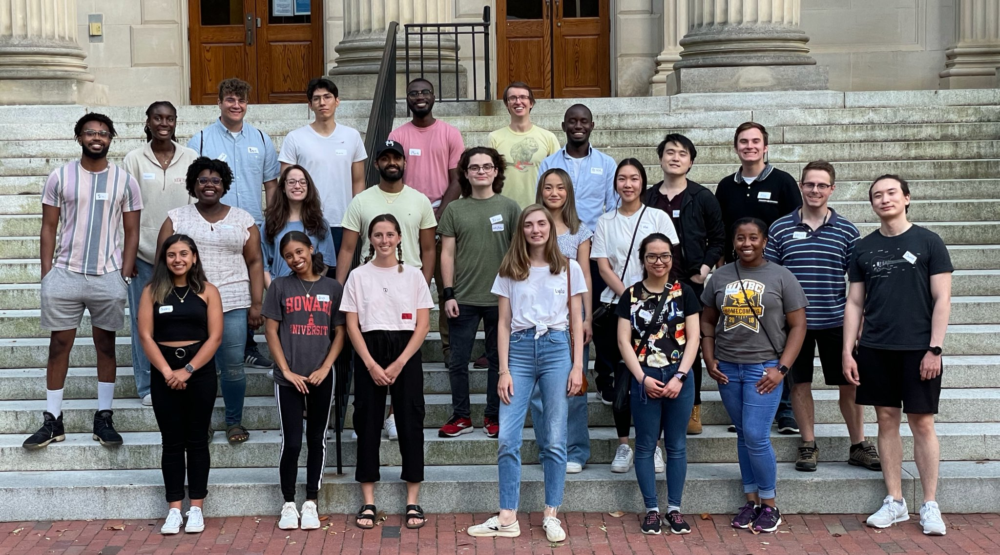
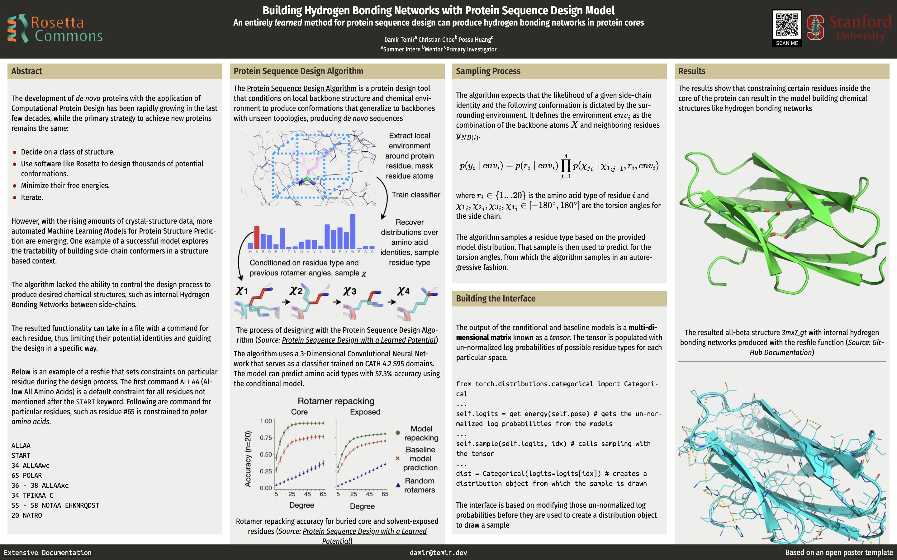
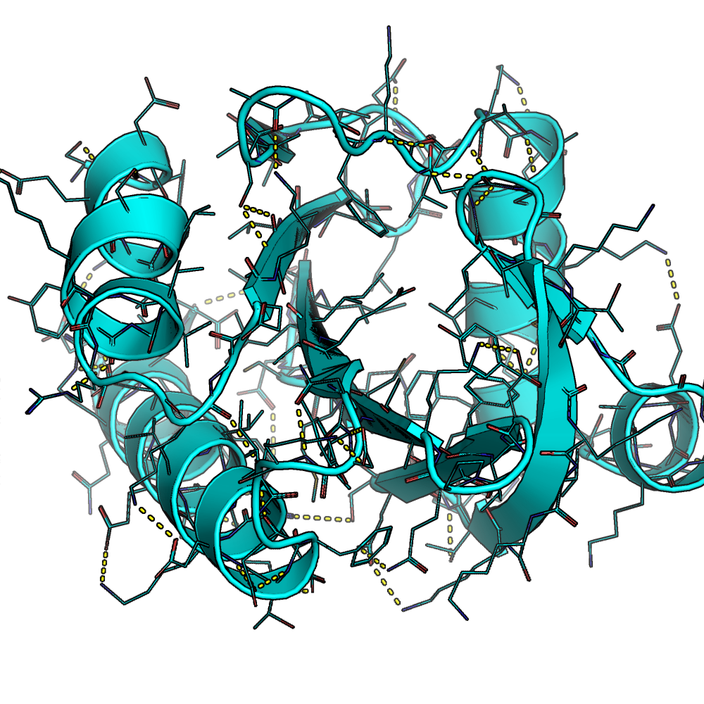
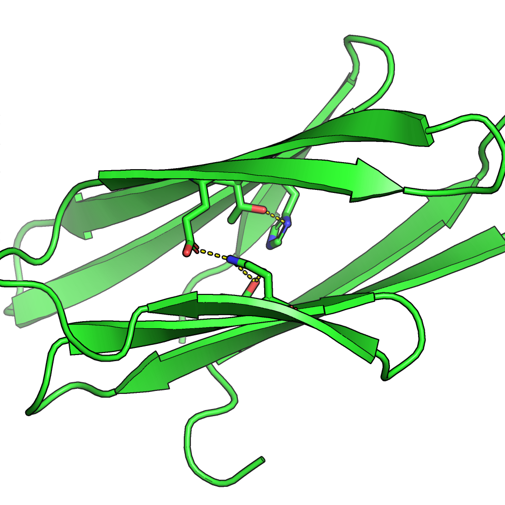

This summer, I had the once-in-a-lifetime opportunity to do research in one of the most exciting areas of bioengineering 
at a top research university. So I figured I'll share my findings and thoughts about it.

Just a quick takeaway: **doing research is awesome and everyone should try to do some in the field they are excited about**.


*rosetta interns, summer 2021 | UNC Chapel Hill*

## Table of contents:
* [Overview](#overview)
* [Rosetta](#rosetta)
* [RosettaCommons](#rosettacommons)
* [Protein Design](#protein-design)
* [Research](#research)
  * [Algorithm](#algorithm)
  * [Approach](#approach)
* [Outcomes](#outcomes)
* [Apply](#apply)

## Overview

This summer I worked as a *research assistant* at **Stanford University, [Huang Lab](http://www.proteindesign.org/)**.
I conducted research in protein sequence design, expanding on the lab's **Deep Learning** project called the **[Protein Sequence Design Algorithm](https://github.com/ProteinDesignLab/protein_seq_des)**
and experimenting with it to build *internal hydrogen bonding networks[^1]*.

The result was a poster titled 
*[Building Hydrogen Bonding Networks with Protein Sequence Design Model](https://temir.dev/projects/rosetta-poster/poster)* and presented at **[Summer RosettaCON 2021](http://www.rosettadesigngroup.com/rosettacon/)**.

[](https://temir.dev/projects/rosetta-poster/poster)
*try clicking on the image*

## Rosetta

First, [Rosetta](https://new.rosettacommons.org/docs/latest/Home) is a cluster of software with algorithms for computational modeling and analysis of protein structures.
Today, it is used to do things like: 
* _de novo protein design_
* _enzyme design_
* _ligand docking_
* _structure prediction_

It first started in the Baker Lab of [Dr. David Baker](https://www.ipd.uw.edu/people/ipd-faculty-staff/david-baker/) at the University of Washington.

Today there is a Python wrapper/interface for it, called [PyRosetta](https://www.pyrosetta.org/).

The goals for Rosetta are to:
* learn more about macromolecular interactions
* design new proteins
* develop an efficient way to search conformation and sequence space[^3]
* find a more useful energy function[^4]


## RosettaCommons


RosettaCommons is an organization of more than 50 universities and institutes around the world who use Rosetta in their research.
The Rosetta source code belongs to _all_ members of RosettaCommons, which means that they pull their efforts together to develop it.

RosettaCommons is also the organization that benefits from licensing the Rosetta software. 
By selling the software to big companies, they are able to host conferences, support labs, and pay interns like me.
However, they provide the software for free to people who want to use it in academic purposes.

The lab I worked at this summer is a part of RosettaCommons. 
Stanford University's Huang Lab is into de novo protein design, 
trying to create new design platforms with Machine Learning.

## Protein Design

Proteins are of immerse significance to humans. 
They are used for structure, function, and management of the body's various tissues and organs.

Designing proteins is a still new field in Bioengineering.
But there have been big steps in developing ways to build proteins from scratch.
All of them require evaluting the structures with already mentioned energy functions.


*a modeled version of an alpha-beta protein in PyMol*

## Research

So my research was about using the output of the Convolutional Neural Network developed by PhD students at Stanford University and adjusting it to bring specificity to the protein design process.

For example, by reading-in a resfile (i.e. a _residue-file_), the algorithm will be limited to deliver the amino acids that we want.
In the protein below, the algorithm was limited to set internal amino acids to be polar.
It caused the protein to have internal hydrogen bonds inside the core of the protein.



### Algorithm

The way the **[Protein Sequence Design Algorithm](https://github.com/ProteinDesignLab/protein_seq_des)** uses its Convolutional Neural Network is:
1. By sampling a random residue on a protein, a single piece from a long sequenced protein.
2. Putting it through the Convolutional Neural Network.
3. Receiving a distribution of possible types of amino acids that it can be. 
4. Sampling from the distribution and replacing that piece.
5. Iterating over and over until the sequence converges.[^6]

{:.ioda}
*the algorithm process*

### Approach

So the [resfile moodule](https://github.com/ProteinDesignLab/protein_seq_des/tree/master/seq_des/util) will take in a file like this,
```
ALLAA # set a default command for all residues not listed below
START
34 ALLAAwc # allow all amino acids at residue #34
65 POLAR # allow only polar amino acids at residue #65
36 - 38 ALLAAxc # allow all amino acids except cysteine at residues #36 to #38 (including)
34 TPIKAA C # set the initial pose sequence postion at residue #34 to cysteine
55 - 58 NOTAA EHKNRQDST # disallow the listed amino acids at residues #55 to #58
20 NATRO # do not design the residue #20 at all
```
and produce a protein structure with all those constraints.

It does this by directly changing the PyTorch tensors used to build the categorical distribution object. For example,
```
logits = enforce_resfile(logits, idx) # update logits based on the file
dist = Categorical(logits=logits[idx]) # create a sampler
res_idx = dist.sample().data.numpy() # get the sampled residue id
```

However, this is not the only way it works. 
There are some more specific instructions for other commands that involve initialization and other.

## Outcomes

I learned a lot over the course of the summer and my research experience. 

* Basics of Protein Design and Computational Biology
* Wrote my first Research Poster
* Built code that will be useful for algorithm users

## Apply

If you're a current college student in STEM, please feel free to learn more about pursuing this internship opportunity.
[Rosetta Commons Research Experience for Undergraduates](https://www.rosettacommons.org/about/intern).

---
{: data-content="footnotes"}

[^1]: Hydrogen bond is a type of chemical interaction between two atoms that have positive and negative charges. Protein cores do not usually have hydrogen bonds because the amino acids inside tend to be hydrophobic, which means they do not carry charge. Internal hydrogen bonding networks are therefore unusual for proteins and show how much *specificity* the project I have worked on can bring to protein design.   
[^3]: Conformation and sequence spaces are vast in protein design. There are many possible ways for proteins to be structured, which makes it very hard to just try out every structure.
[^4]: Energy function can tell us whether a protein structure is efficient. It takes into account many chemical theories to determine whether a structure is stable. It usually serves as a guide for us to see if a structure is going to work, but it is not completely accurate due to the limited knowledge base.
[^6]: It might take hours for the algorithm to run on a moderately long sequence for 2,500 iterations that it usually requires for it to converge. I would prepare the design I want to run during the day, and submit the jobs for designs to the Stanford server before going to bed. That way I would get the results in the morning. 
