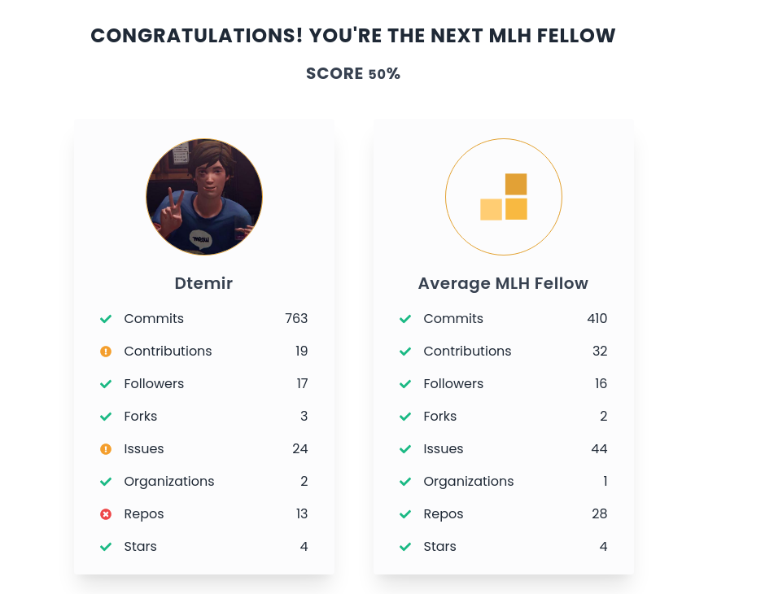
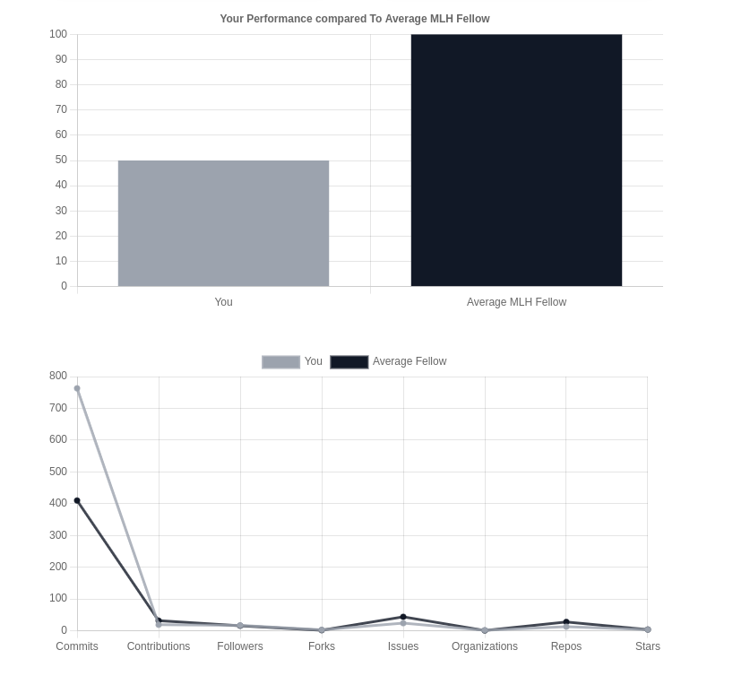
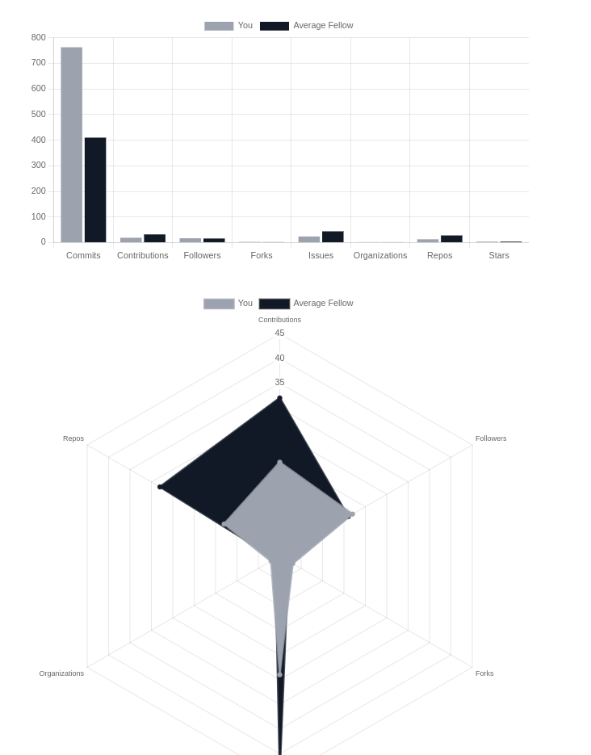
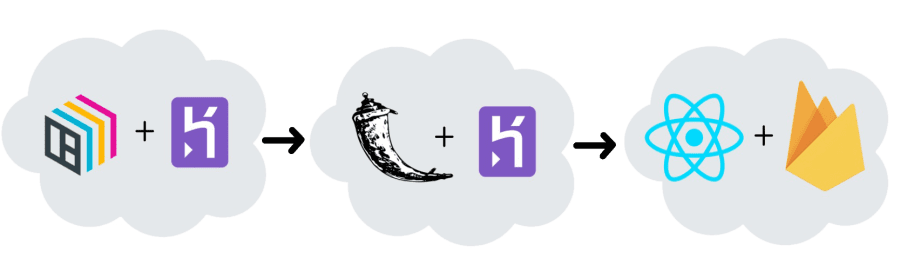

As a team of four developers, we wanted to help prospective [Major League Hacking Fellows](https://fellowship.mlh.io/)
with their progress towards better GitHub profiles with solid projects and a record of active work.
**We wanted to give them insights into what an *average fellow* looks like.**

So our answer was the **Fellowship Prediction**, a tool that analyses your GitHub profile and presents you with a report how likely you're to become the next MLH Fellow.

[Try it here](https://fellowship-prediction.web.app/).[^1]

{:.ioda}
*my github profile compared to the average mlh fellow*

## Table of contents:
* [What it does?](#what-it-does)
* [How we built it?](#how-we-built-it)
  * [Tech Stack](#tech-stack)
  * [Data Mining](#data-mining)
  * [BentoML](#bentoml)
* [Challenges](#challenges)
* [Accomplishments](#accomplishments)
* [Things Learned](#things-learned)
* [Next](#next)

## What it does?

The app provides you with an extensive analysis on the following features of your profile.

<table class="responsive"><thead>
<tr>
<th style="">Feature</th>
<th>Description</th>
</tr>
</thead><tbody>
<tr>
<td style="">Commits</td>
<td>Number of total commits the user made</td>
</tr>
<tr>
<td style="">Contributions</td>
<td>Number of repositories where the user made contributions</td>
</tr>
<tr>
<td style="">Followers</td>
<td>Number of followers the user has</td>
</tr>
<tr>
<td style="">Forks</td>
<td>Number of forks the user has in their repositories</td>
</tr>
<tr>
<td style="">Issues</td>
<td>Number of issues the user has raised</td>
</tr>
<tr>
<td style="">Organizations</td>
<td>Number of organizations the user is a part of</td>
</tr>
<tr>
<td style="">Repos</td>
<td>Number of repositories the user has</td>
</tr>
<tr>
<td style="">Stars</td>
<td>Number of stars the user has on their repositories</td>
</tr>
</tbody></table>

and assigns you a comprehensive score of how similar your GitHub profile is to an average MLH Fellow's GitHub.

It also shows your statistics in a **user-friendly data visualization** for you to **gauge the range of your skills and become the next MLH Fellow**.

{:.ioda}

{:.ioda}

## How we built it?

{:.ioda}
*the score is sent from left to right to get back to the user*

### Tech Stack

We used the following technologies:

* **BentoML** along with **Heroku** to build an API endpoint that calculates the comprehensive score for the user based on a simple query.
* **Flask** deployed to **Heroku** to setup a bridge between the frameworks and collect the input data.
* **React.js** served on **Firebase** to provide user-friendly UI for future MLH fellows to use.

### Data Mining

* We **mined data** on over 600 MLH Fellows who are a part of the [MLH Fellowship Organization](https://github.com/MLH-Fellowship) on GitHub.
* We **used GitHub API extensively** to gather data on their repositories, organizations, followers, and anything else that could indicate the level of success.
* We then **conducted analysis** in [Data Analysis Notebooks](https://github.com/dtemir/fellowship-prediction/blob/main/model/fetching-data.ipynb) where we show feature and data extraction process.

### BentoML

* Our main goal, as a part of the MLH Open-Source Fellowship, was to **use an open-source project** on which we're going to work on throughout the fellowship.
* We were able to use **BentoML Prediction Service API** that accepts REST API requests and returns back JSON-formatted score for each user.
* We **deployed the BentoML API to Heroku** using a Docker Image.

## Challenges

Unfortunately, we could not collect all the necessary data to follow the initial plan on prediction whether a user will make it to the Fellowship.
It was difficult to obtain data of people who applied and did not get in the program since there is no such database.
Therefore, our program was limited to a simple statistical analysis and not Machine Learning models.

## Accomplishments

* We are proud of using the open source project, **BentoML**.
* We are proud of getting the whole project done under a big difference in time zones.
* We also feel good about the opportunity to help future MLH Fellows in their path to a good GitHub profile.

## Things Learned

* We learned that complex applications using different frameworks can be easily built when there are proper connection nodes between them.
* We also learned about the importance of team work because we all contributed major parts of the project, making it a wholesome experience for each other and delivering a better product.

## Next

* We hope to develop a **Machine Learning model** with the data that we already have and some data that we will gather later on to have a proper, data-driven score rank.
* We also hope to look into the **ANOVA analysis** for our statistical comparison to determine things like the p-value of somebody getting accepted to the Fellowship based on their data.
* We would also like to get a **domain name** for the project for better reach to people.

---
{: data-content="footnotes"}

[^1]: The app might become inactive after a period of time. We could run out of free-trials, credits, or something broke. Please check our [github repo](https://github.com/dtemir/fellowship-prediction) instead.
